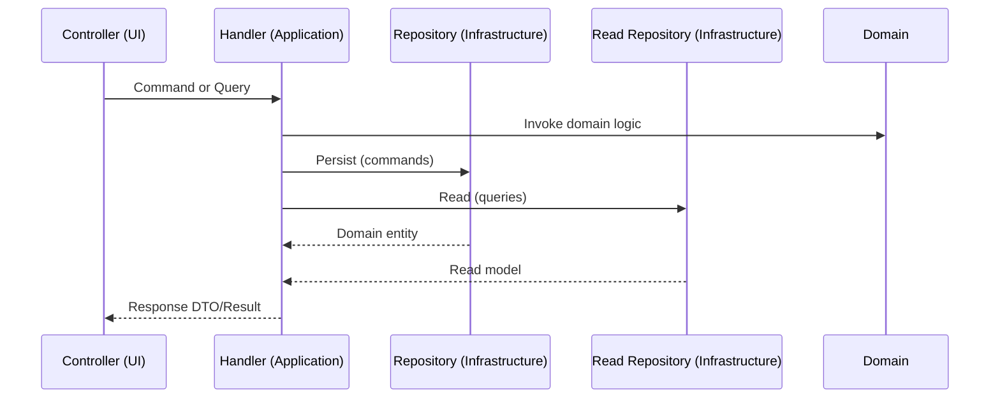

# Project Architecture

## Overview

ResumeHaven is a modern PHP application built with strict type safety and containerized development. This document outlines the project structure, design decisions, and how components interact.

## Architecture Diagrams

### Layered Architecture


### CQRS Flow



## Project Structure

```
resume-haven/
├── app/                          # Application source code
│   ├── Domain/                   # Domain layer (entities, value objects)
│   ├── Application/              # Application layer (use cases, handlers)
│   ├── Infrastructure/           # Infrastructure layer (persistence, adapters)
│   ├── Http/                     # UI layer (controllers, middleware, requests)
│   └── ...
├── public/                       # Web-accessible files
│   ├── index.php                 # Application entry point
│   ├── css/                      # Stylesheets
│   ├── js/                       # JavaScript
│   └── assets/                   # Images, fonts, etc.
├── bootstrap/                    # Application initialization
│   └── app.php                   # Bootstrap configuration
├── storage/                      # Runtime data
│   ├── logs/                     # Application logs
│   ├── cache/                    # Temporary cache
│   └── exports/                  # Generated exports
├── database/                     # Data layer
│   ├── migrations/               # Schema changes
│   ├── factories/                # Model factories
│   └── seeders/                  # Sample data
├── routes/                       # Route definitions
│   └── api.php                   # API routes
├── tests/                        # Test suites
│   ├── Unit/                     # Unit tests
│   ├── Feature/                  # Integration tests
│   └── ...
├── docker/                       # Docker configuration
│   ├── FrankenPHP/
│   │   ├── Dockerfile
│   │   ├── Caddyfile
│   │   └── xdebug.ini
│   └── entrypoint.sh
├── docs/                         # Documentation
├── docker-compose.yml            # Multi-container orchestration
├── .env.docker                   # Environment template
└── README.md                     # Project documentation
```

Current UI layer lives in `app/Http` (controllers, middleware, requests). A separate Vue.js frontend is planned for a later phase.

## Core Concepts

### Strict Type Safety

All PHP files use `declare(strict_types=1)`:

```php
<?php
declare(strict_types=1);

namespace App\Domain\Entities;

class Resume
{
    private string $name;
    private array $sections = [];
    
    public function __construct(string $name)
    {
        $this->name = $name;
    }
}
```

**Benefits:**
- Runtime type checking prevents bugs
- IDE can detect type mismatches
- Self-documenting code
- Easier debugging

### Namespacing

Organize code by responsibility (DDD layers):

```
App\
├── Domain\              # Core business logic
│   ├── Entities\        # Domain entities
│   ├── ValueObjects\    # Immutable value objects
│   ├── Contracts\       # Domain interfaces
│   └── Services\        # Domain services
├── Application\         # Use cases and orchestration
│   ├── Commands\        # Write operations
│   ├── Queries\         # Read operations
│   ├── Handlers\        # CQRS handlers
│   ├── Contracts\       # Read repository interfaces
│   ├── DTOs\            # Data transfer objects
│   ├── ReadModels\      # Query models
│   └── Services\        # Application services
├── Infrastructure\      # External dependencies
│   ├── Persistence\     # Eloquent models
│   ├── Repositories\    # Repository + read repository implementations
│   └── External\        # External API integrations
├── Http\                # UI layer (controllers, middleware)
└── ...
```

### Dependency Injection

Request dependencies explicitly:

```php
<?php
declare(strict_types=1);

class ResumeApplicationService
{
    public function __construct(
        private ResumeRepositoryInterface $repository,
    ) {}
    
    public function create(array $data): Resume
    {
        return $this->repository->save(new Resume(...$data));
    }
}
```

## Design Patterns

### Repository Pattern

Abstract data access:

```php
<?php
declare(strict_types=1);

interface ResumeRepositoryInterface
{
    public function findById(string $id): ?Resume;
    public function findAll(): array;
    public function save(Resume $resume): void;
    public function delete(string $id): void;
}

class EloquentResumeRepository implements ResumeRepositoryInterface
{
    // Implementation details
}

interface ResumeReadRepositoryInterface
{
    public function findById(string $id): ?ResumeReadModel;
}

class EloquentResumeReadRepository implements ResumeReadRepositoryInterface
{
    // Read-model mapping for queries
}
```

**Benefits:**
- Switch storage backends easily
- Mock for testing
- Centralized data logic

### Service Layer

Encapsulate business logic:

```php
<?php
declare(strict_types=1);

class ResumeApplicationService
{
    public function __construct(
        private ResumeRepositoryInterface $repository,
        private ExportService $exporter,
    ) {}
    
    public function buildAndExport(
        string $resumeId,
        string $format,
    ): string {
        $resume = $this->repository->findById($resumeId);
        if ($resume === null) {
            throw new \DomainException('Resume not found');
        }
        
        return $this->exporter->export($resume, $format);
    }
}
```

**Benefits:**
- Separates business logic from data access
- Reusable across controllers
- Easier to test
- Clear service boundaries

### Factory Pattern

Create complex objects:

```php
<?php
declare(strict_types=1);

class ResumeFactory
{
    public static function fromArray(array $data): Resume
    {
        $resume = new Resume($data['name']);
        
        foreach ($data['sections'] ?? [] as $sectionData) {
            $resume->addSection(
                $sectionData['type'],
                self::createSection($sectionData)
            );
        }
        
        return $resume;
    }
    
    private static function createSection(array $data): Section
    {
        return match ($data['type']) {
            'experience' => new ExperienceSection(...),
            'education' => new EducationSection(...),
            default => throw new \InvalidArgumentException(),
        };
    }
}
```

**Benefits:**
- Centralized object creation
- Consistent initialization
- Complex validation logic

### Value Objects

Immutable data containers:

```php
<?php
declare(strict_types=1);

class Email
{
    public function __construct(
        private string $address,
    ) {
        if (!filter_var($address, FILTER_VALIDATE_EMAIL)) {
            throw new \InvalidArgumentException('Invalid email');
        }
    }
    
    public function value(): string
    {
        return $this->address;
    }
}

// Usage
$email = new Email('user@example.com');
$validated = true; // Type system guarantees validity
```

## Layered Architecture

```
┌─────────────────────┐
│   Presentation      │  Controllers, API responses
├─────────────────────┤
│   Application       │  Services, use cases
├─────────────────────┤
│   Domain            │  Models, business logic
├─────────────────────┤
│   Infrastructure    │  Database, external APIs
└─────────────────────┘
```

### Layer Responsibilities

**Presentation Layer**
- HTTP request/response handling
- Input validation
- Response formatting

**Application Layer**
- Orchestration of services
- Transaction management
- Cross-cutting concerns

**Domain Layer**
- Business rules
- Entity models
- Domain logic

**Infrastructure Layer**
- Database access
- External service calls
- File I/O operations

## Data Flow

```
HTTP Request
    ↓
Controller (validate input)
    ↓
Service (apply business logic)
    ↓
Repository (data access)
    ↓
Database (store/retrieve data)
    ↓
Mapper (transform to view model)
    ↓
HTTP Response
```

## Error Handling Strategy

### Exception Hierarchy

```php
<?php
declare(strict_types=1);

abstract class ApplicationException extends \Exception {}

// Domain exceptions
class InvalidResumeException extends ApplicationException {}
class ResumeNotFoundException extends ApplicationException {}

// Application exceptions
class ValidationException extends ApplicationException {}
class ExportException extends ApplicationException {}
```

### Error Handling

```php
<?php
declare(strict_types=1);

try {
    $resume = $service->buildResume($data);
} catch (InvalidResumeException $e) {
    // Log and return user-friendly error
    Log::warning('Resume validation failed', ['error' => $e->getMessage()]);
    return response()->json(['error' => 'Invalid resume data'], 422);
} catch (ApplicationException $e) {
    // Log application-level errors
    Log::error('Resume build failed', ['error' => $e->getMessage()]);
    return response()->json(['error' => 'Internal server error'], 500);
}
```

## Testing Strategy

### Unit Tests

Test individual components in isolation:

```php
<?php
declare(strict_types=1);

class ResumeTest extends TestCase
{
    public function testCanCreateResume(): void
    {
        $resume = new Resume('John Doe');
        
        $this->assertEquals('John Doe', $resume->name());
    }
    
    public function testThrowsOnInvalidName(): void
    {
        $this->expectException(\InvalidArgumentException::class);
        
        new Resume('');
    }
}
```

### Integration Tests

Test component interactions:

```php
<?php
declare(strict_types=1);

class ResumeServiceTest extends TestCase
{
    public function testCanBuildCompleteResume(): void
    {
        $repository = new MockResumeRepository();
        $exporter = new MockExportService();
        $service = new ResumeBuilderService($repository, $exporter);
        
        $result = $service->buildAndExport('123', 'pdf');
        
        $this->assertNotEmpty($result);
    }
}
```

## Container Configuration

### FrankenPHP Container

```
┌─────────────────────────┐
│   FrankenPHP Container  │
├─────────────────────────┤
│  Caddy Web Server       │
│  PHP 8.5.2              │
│  Xdebug 3.5.0           │
│  Composer               │
│  SQLite                 │
└─────────────────────────┘
    ↓
  HTTP/HTTPS
    ↓
┌─────────────────────────┐
│   Host Machine          │
│   Port 80, 443          │
└─────────────────────────┘
```

### Volume Architecture

```
Host Machine                Container
────────────────          ──────────
./ ────────────────────→  /var/www/html
storage/ ─────────────→  /var/www/html/storage
bootstrap/cache/ ──────→  /var/www/html/bootstrap/cache
```

## Configuration Management

### Environment Configuration

```
.env.docker (template)
    ↓
.env (instance-specific)
    ↓
Application Configuration
```

**Development**
```env
APP_ENV=local
APP_DEBUG=true
DB_CONNECTION=sqlite
XDEBUG_MODE=debug
```

**Production**
```env
APP_ENV=production
APP_DEBUG=false
XDEBUG_MODE=off
```

## Performance Considerations

### Type Safety Overhead

- Minimal: ~0.5% in PHP 8.5
- One-time cost at function entry
- No runtime performance loss for type checking

### Code Organization Benefits

- Faster debugging
- Fewer bugs in production
- Better IDE support
- Self-documenting code

## Security Architecture

### Input Validation

All user input validated at entry points:

```php
public function createResume(array $input): Resume
{
    // Validate structure
    // Validate field types
    // Validate field values
    // Sanitize strings
}
```

### Error Information

Never expose sensitive details:

```php
// ❌ Bad: Exposes internals
catch (\Throwable $e) {
    return response()->json(['error' => $e->getMessage()], 500);
}

// ✅ Good: Generic message
catch (\Throwable $e) {
    Log::error('Unexpected error', ['exception' => $e]);
    return response()->json(['error' => 'Internal server error'], 500);
}
```

## Deployment Considerations

### Container-Based Deployment

1. Build Docker image
2. Push to registry
3. Deploy to orchestrator (Kubernetes, Docker Swarm, etc.)
4. Mount persistent volumes for storage

### Database Migrations

```bash
docker-compose exec app php artisan migrate
```

### Configuration Management

- Environment variables via `.env`
- Secrets via Docker secrets (production)
- Configuration files (development)

## Future Improvements

1. **Async Operations**: Use queues for long-running tasks
2. **Caching**: Redis for performance optimization
3. **API Documentation**: OpenAPI/Swagger
4. **Analytics**: Usage tracking and metrics
5. **Search**: Full-text search for resumes
6. **Collaboration**: Multi-user editing

## Diagrams

### Request Flow

```
┌─────────────┐
│   Browser   │
└──────┬──────┘
       │ HTTP Request
       ▼
┌─────────────────┐
│   Controller    │
└────────┬────────┘
         │ Validate Input
         ▼
┌─────────────────┐
│    Service      │
└────────┬────────┘
         │ Apply Logic
         ▼
┌─────────────────┐
│  Repository     │
└────────┬────────┘
         │ Data Access
         ▼
┌─────────────────┐
│   Database      │
└────────┬────────┘
         │ Record
         ▼
┌─────────────────────┐
│  Response to Browser│
└─────────────────────┘
```

### Type Safety Flow

```
Code Written
    ↓
declare(strict_types=1) enabled
    ↓
PHP Parser validates types at runtime
    ↓
Type Mismatch Found
    ↓
Immediate Exception thrown
    ↓
Bug caught early, not in production
```

## Resources

- [Design Patterns in PHP](https://designpatternsphp.readthedocs.io/)
- [Clean Code Principles](https://www.oreilly.com/library/view/clean-code-a/9780136083238/)
- [Domain-Driven Design](https://www.domainlanguage.com/ddd/)
- [SOLID Principles](https://en.wikipedia.org/wiki/SOLID)

## Next Steps

- [Development Guide](DEVELOPMENT.md) - Code standards
- [Docker Setup](DOCKER.md) - Container management
- [Xdebug Debugging](XDEBUG.md) - Debugging setup
