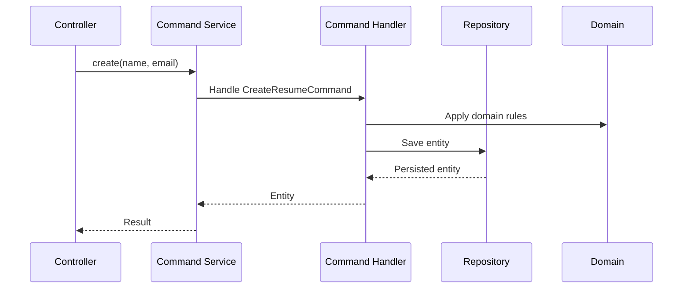
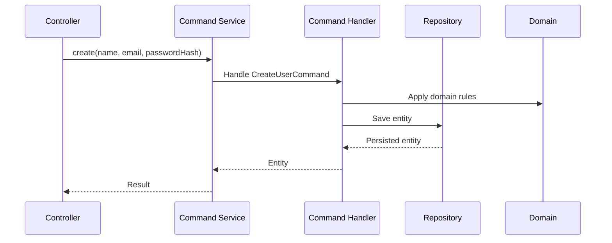
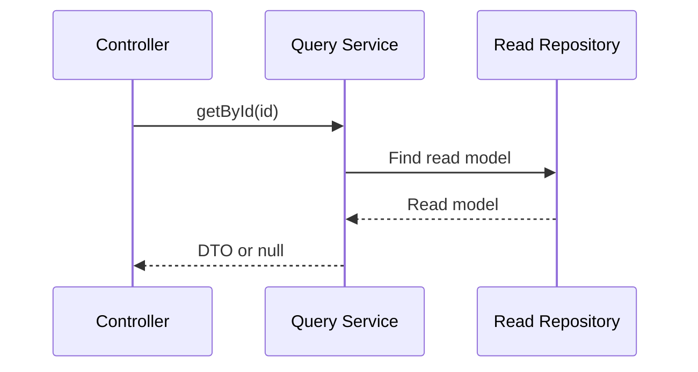

# Controller Flows

## Command Flow

### Resume Command Flow

Controllers should be thin and delegate to the command service:

```php
<?php
declare(strict_types=1);

final class ResumeController
{
    public function __construct(
        private ResumeQueryService $queries,
        private ResumeCommandService $commands,
    ) {}

    public function store(Request $request): JsonResponse
    {
        $data = $request->validate([
            'name' => ['required', 'string', 'max:200'],
            'email' => ['required', 'email'],
        ]);

        $resume = $this->commands->create($data['name'], $data['email']);

        return response()->json([
            'id' => $resume->id,
            'name' => $resume->name->value,
            'email' => $resume->email->value,
        ], 201);
    }
}
```

Flow summary:
1. Controller validates input.
2. Controller calls `ResumeCommandService`.
3. Command service builds a command and forwards to the handler.
4. Handler applies domain logic and persists through repository.
5. Handler emits a domain event.
6. Controller returns a minimal response DTO.

Typical responses:

```json
{
    "id": 1,
    "name": "Test Resume",
    "email": "resume@example.com"
}
```



### Resume Update Command Flow

```php
<?php
declare(strict_types=1);

final class ResumeController
{
    public function update(int $id, Request $request): JsonResponse
    {
        $data = $request->validate([
            'name' => ['required', 'string', 'max:200'],
            'email' => ['required', 'email', 'max:255'],
        ]);

        $resume = $this->commands->update($id, $data['name'], $data['email']);

        if ($resume === null) {
            return response()->json(['message' => 'Resume not found.'], 404);
        }

        return response()->json([
            'id' => $resume->id->value,
            'name' => $resume->name->value,
            'email' => $resume->email->value,
        ]);
    }
}
```

Flow summary:
1. Controller validates input.
2. Controller calls `ResumeCommandService`.
3. Command service forwards to the update handler.
4. Handler loads entity, applies changes, and persists.
5. Handler emits a domain event.
6. Controller returns the updated DTO or 404.

### Resume Delete Command Flow

```php
<?php
declare(strict_types=1);

final class ResumeController
{
    public function destroy(int $id): JsonResponse
    {
        $resume = $this->commands->delete($id);

        if ($resume === null) {
            return response()->json(['message' => 'Resume not found.'], 404);
        }

        return response()->noContent();
    }
}
```

Flow summary:
1. Controller calls `ResumeCommandService` with an ID.
2. Command service forwards to the delete handler.
3. Handler loads the entity and deletes it through the repository.
4. Handler emits a domain event.
5. Controller returns 204 or 404.

### User Command Flow

```php
<?php
declare(strict_types=1);

final class UserController
{
    public function __construct(
        private UserQueryService $queries,
        private UserCommandService $commands,
    ) {}

    public function store(Request $request): JsonResponse
    {
        $data = $request->validate([
            'name' => ['required', 'string', 'max:200'],
            'email' => ['required', 'email'],
            'password' => ['required', 'string', 'min:8'],
        ]);

        $user = $this->commands->create(
            $data['name'],
            $data['email'],
            Hash::make($data['password']),
        );

        return response()->json([
            'id' => $user->id,
            'name' => $user->name->value,
            'email' => $user->email->value,
        ], 201);
    }
}
```

Flow summary:
1. Controller validates input.
2. Controller calls `UserCommandService`.
3. Command service builds a command and forwards to the handler.
4. Handler applies domain logic and persists through repository.
5. Handler emits a domain event.
6. Controller returns a minimal response DTO.

Typical responses:

```json
{
    "id": 1,
    "name": "Test User",
    "email": "user@example.com"
}
```

Validation error response (422):

```json
{
    "message": "The given data was invalid.",
    "errors": {
        "email": ["The email must be a valid email address."],
        "name": ["The name field is required."],
        "password": ["The password must be at least 8 characters."]
    }
}
```



### User Update Command Flow

```php
<?php
declare(strict_types=1);

final class UserController
{
    public function update(int $id, Request $request): JsonResponse
    {
        $data = $request->validate([
            'name' => ['required', 'string', 'max:200'],
            'email' => ['required', 'email', 'max:255'],
            'password' => ['nullable', 'string', 'min:8', 'max:255'],
        ]);

        $password = $data['password'] ?? null;
        $passwordHash = $password !== null ? Hash::make($password) : null;

        $user = $this->commands->update(
            $id,
            $data['name'],
            $data['email'],
            $passwordHash,
        );

        if ($user === null) {
            return response()->json(['message' => 'User not found.'], 404);
        }

        return response()->json([
            'id' => $user->id->value,
            'name' => $user->name->value,
            'email' => $user->email->value,
        ]);
    }
}
```

Flow summary:
1. Controller validates input.
2. Controller calls `UserCommandService`.
3. Command service forwards to the update handler.
4. Handler loads entity, applies changes, and persists.
5. Handler emits a domain event.
6. Controller returns the updated DTO or 404.

### User Delete Command Flow

```php
<?php
declare(strict_types=1);

final class UserController
{
    public function destroy(int $id): JsonResponse
    {
        $user = $this->commands->delete($id);

        if ($user === null) {
            return response()->json(['message' => 'User not found.'], 404);
        }

        return response()->noContent();
    }
}
```

Flow summary:
1. Controller calls `UserCommandService` with an ID.
2. Command service forwards to the delete handler.
3. Handler loads the entity and deletes it through the repository.
4. Handler emits a domain event.
5. Controller returns 204 or 404.

## Query Flow

### Resume Query Flow

Query endpoints should be read-only and return DTOs from query services:

```php
<?php
declare(strict_types=1);

final class ResumeController
{
    public function __construct(
        private ResumeQueryService $queries,
        private ResumeCommandService $commands,
    ) {}

    public function show(int $id): JsonResponse
    {
        $resume = $this->queries->getById($id);

        if ($resume === null) {
            return response()->json(['message' => 'Resume not found.'], 404);
        }

        return response()->json($resume);
    }
}
```

Flow summary:
1. Controller calls `ResumeQueryService` with an ID.
2. Query service reads from read repository and returns a read model.
3. Controller returns the DTO or a 404 response.

Not found response:

```json
{
    "message": "Resume not found."
}
```



### User Query Flow

```php
<?php
declare(strict_types=1);

final class UserController
{
    public function __construct(
        private UserQueryService $queries,
        private UserCommandService $commands,
    ) {}

    public function show(int $id): JsonResponse
    {
        $user = $this->queries->getById($id);

        if ($user === null) {
            return response()->json(['message' => 'User not found.'], 404);
        }

        return response()->json($user);
    }
}
```

Flow summary:
1. Controller calls `UserQueryService` with an ID.
2. Query service reads from read repository and returns a read model.
3. Controller returns the DTO or a 404 response.

Not found response:

```json
{
    "message": "User not found."
}
```


