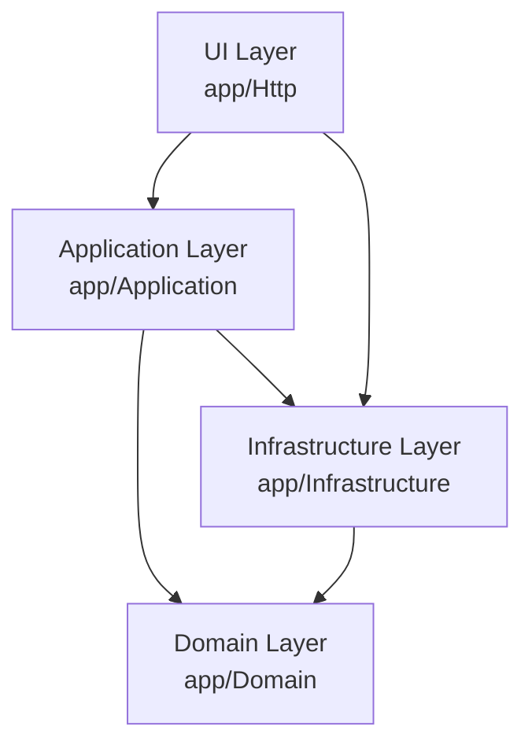
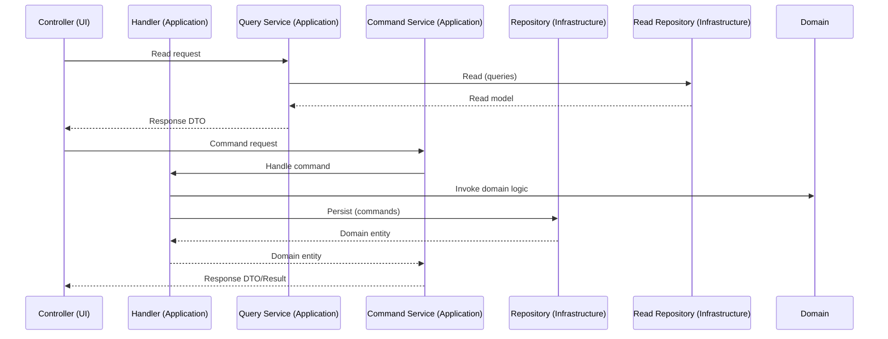

# Overview

ResumeHaven is a modern PHP application built with strict type safety and containerized development. This document outlines the project structure, design decisions, and how components interact.

## Architecture Diagrams

### Layered Architecture

### CQRS Flow

